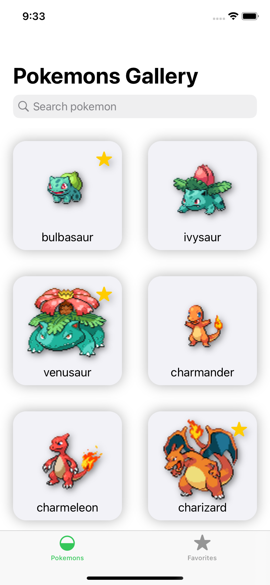
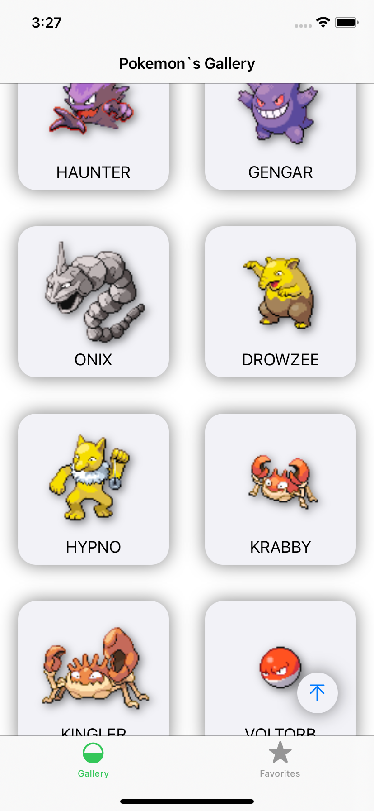
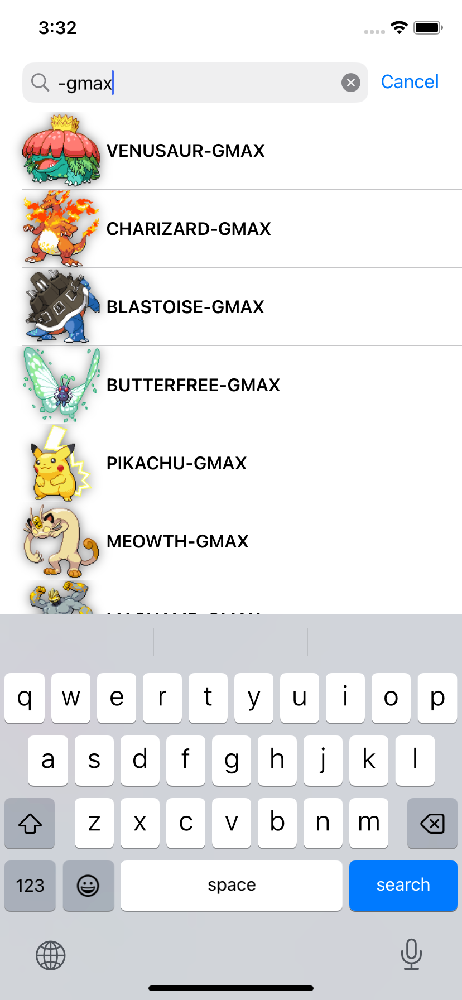
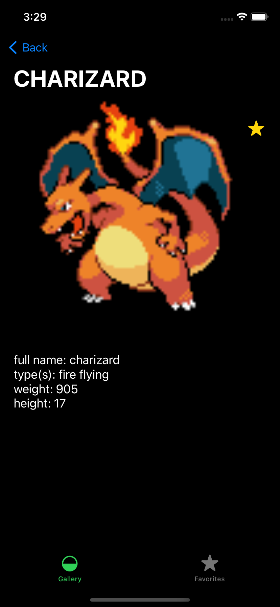
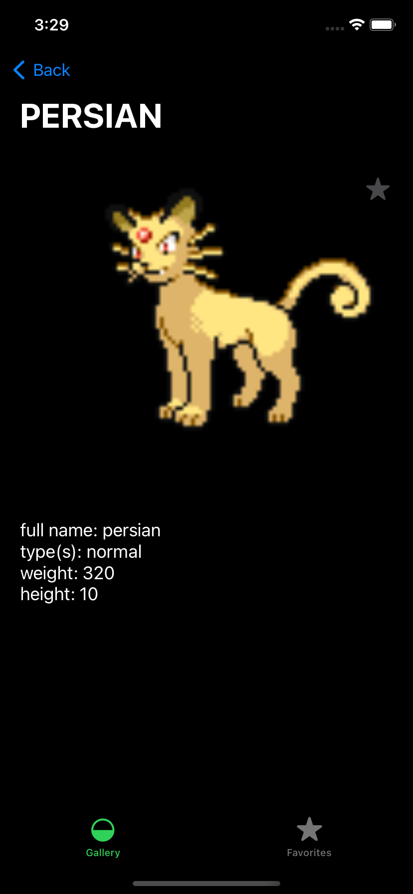
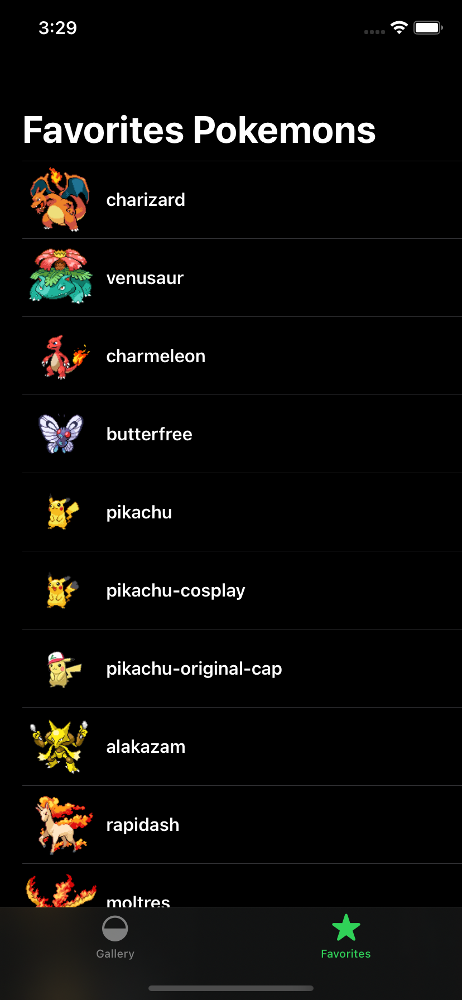

# Pokemon App
Test Swift iOS app
***
### Description
>This app display pokemon names from https://pokeapi.co/api/v2/pokemon.
When a user clicks on cell, then the details screen is opened.
The Pokemon details page will use the API https://pokeapi.co/api/v2/pokemon/{id}/.
***
### Software stack of knowledge
>- Swift, UIKit
>- URLSession + Network errors handle
>- MVP - Architecture
>- SOLID / DI
>- UserDefaults
>- AutoLayout
***
### Features
>- Button to scroll up
>- Search bar to search pokemon
>- Save pokemons to "Favorites Pokemons" to view those in offline mode

>- Support light and dark mode
***
### Screenshots

***
